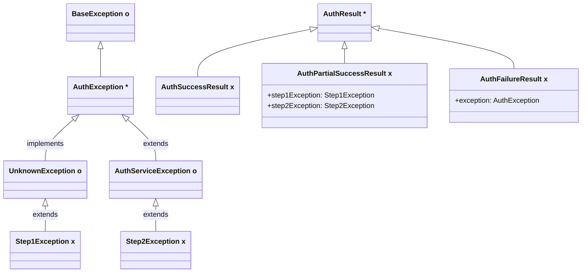
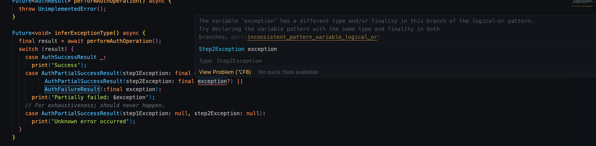
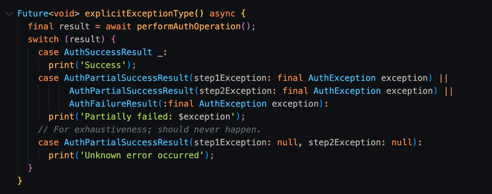
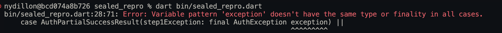

# Sealed Class Repro

Given the following class hierarchy:

```
Legend:
  Open Class (o)
  Sealed Class (*)
  Final Class (x)
```



In `base_exception.dart` we define an exception hiearchy for which all classes inherit `BaseException`. From this, we derive `AuthException` which is sealed and has discrete subtypes, namely `UnknownException` and `AuthServiceException`.

In `auth_result.dart`, we define the result of an Auth operation. The result takes one of three discrete states: a successful result (`AuthSuccessResult`); a partial success (`AuthPartialSuccessResult`) where either the first or second step of the operation failed with an `AuthException`; and a complete failure (`AuthFailureResult`).

---

Given a method which performs an Auth operation:

```dart
Future<AuthResult> performAuthOperation();
```

We expect the following to work:

## 1. Inference on exception type

```dart
final result = await performAuthOperation();
switch (result) {
case AuthSuccessResult _:
    print('Success');
case AuthPartialSuccessResult(step1Exception: final exception?) ||
        AuthPartialSuccessResult(step2Exception: final exception?) ||
        AuthFailureResult(:final exception):
    print('Partially failed: $exception');
// For exhaustiveness; should never happen.
case AuthPartialSuccessResult(step1Exception: null, step2Exception: null):
    print('Unknown error occurred');
}
```

In the second branch, `step1Exception`, `step2Exception`, and `exception` are all subclasses of `AuthException`, yet its type cannot be inferred. The Analyzer presents the error:

```
The variable 'exception' has a different type and/or finality in this branch of the logical-or pattern.
Try declaring the variable pattern with the same type and finality in both branches.dartinconsistent_pattern_variable_logical_or
```



## 2. Explicit exception type

```dart
final result = await performAuthOperation();
switch (result) {
  case AuthSuccessResult _:
    print('Success');
  case AuthPartialSuccessResult(step1Exception: final AuthException exception) ||
        AuthPartialSuccessResult(step2Exception: final AuthException exception) ||
        AuthFailureResult(:final AuthException exception):
    print('Partially failed: $exception');
  // For exhaustiveness; should never happen.
  case AuthPartialSuccessResult(step1Exception: null, step2Exception: null):
    print('Unknown error occurred');
}
```

By explicitly specifying the exception types as `AuthException`, the analyzer stops complaining.



However, upon compilation, we get a similar error:

```
bin/sealed_repro.dart:28:71: Error: Variable pattern 'exception' doesn't have the same type or finality in all cases.
    case AuthPartialSuccessResult(step1Exception: final AuthException exception) ||
                                                                      ^^^^^^^^^
```

